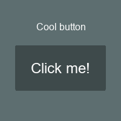

# GUI Basics

GUIs in BlurEngine may seem complicated at first, but it is quite simple once you get the hang of it. It is limited to manually setting the positioning and sizes yourself in the code.

## Introduction

GUIs are divided into [GUI](../api-reference/classes/class_GUI.md) and [GUIObject](../api-reference/classes/class_GUIObject.md) classes.

All GUIs work using a centralized system. This means that for every part of your interface you wish to implement there is 1 GUI class object which serves as a parent to 1 or more GUIObject class children. You **can** have multiple GUIs in a BlurEngine instance.

## Making the GUIs

Every GUI needs to be instantiated using **gui.new()** or **gui.newObject()**. You will also need to set its size and position. To see all kinds of GUIs and GUIObjects, look up **GUI** and **GUIObject**.

Here is a code example demonstarting this, where we will be making a simple [button](../api-reference/classes/class_Button.md) and text script:

```lua
mainGUI = gui.new("GUI")
mainGUI.Position = Vector(300,300)
mainGUI.Size = Vector(200,200)

titleGUI = gui.newObject("Label")
titleGUI.Position = Vector(60,150)
titleGUI.Size = Vector(100,50)
titleGUI.Text = "Cool button"

buttonGUI = gui.newObject("Button")
buttonGUI.Position = Vector(25,50)
buttonGUI.Size = Vector(150,75)
buttonGUI.Text = "Click me!"
```

### Initializing the GUIs

If we run the code above, nothing will happen. Why?

It's because we haven't initialized the GUIs properly. To do that, the function **gui.register()** and the **GUI** method **:addObject()**. If we would like to **hide** a gui, we can do this using the **gui.unregister()** function.

Here's how we do it:

```lua
mainGUI:addObject(titleGUI)
mainGUI:addObject(buttonGUI)
-- Adds the title GUIObject and the button GUIObject to the main GUI class object.

gui.register(mainGUI)
-- This will make mainGUI and its objects render/appear in game view.
```

Simple, right?

Here's the result of our code:



This is a basic GUI, you can't interact with it yet and it doesn't look too pretty. To see how to do other things like changing fonts or adding button functions, check out the [GUI class.](../api-reference/classes/class_GUI.md)